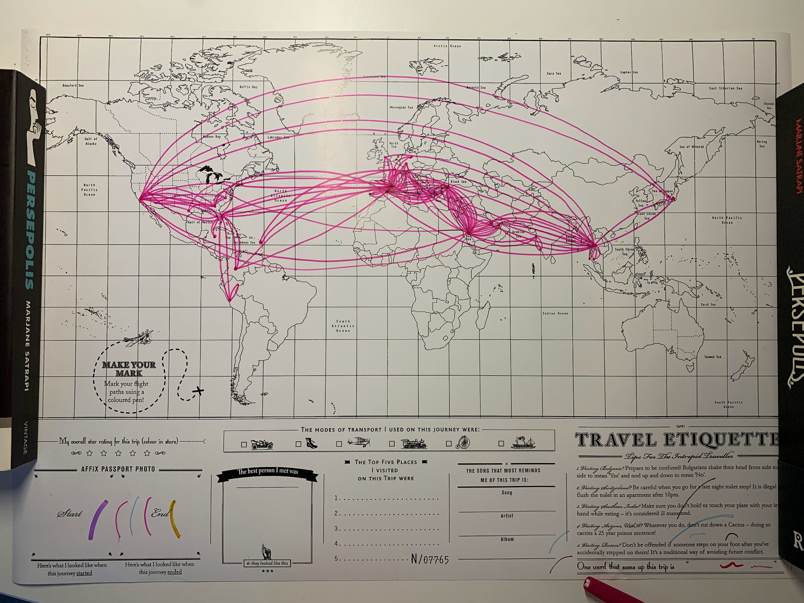
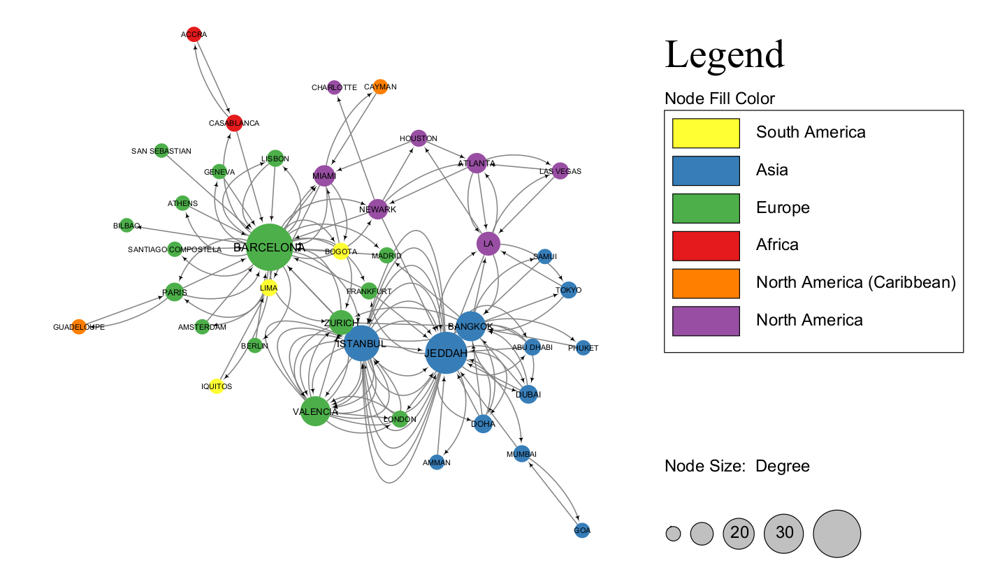

**Making a network of my flights**

Since I was born my parents have tracked every flight I've taken in a little book, a project that I have now taken up. 
So I decided to make a graph representing all the flights I have taken up until now.

I counted them all by hand, but here is a rough visual reconstruction of the book on a world map, which is also interesting to look at.

I used some styling to color code the cities by continent, and this is the final result:

